# Les packages

## Les packages utilisés dans ce module

- `{sf}` (4.4) : fonctions sur les objets spatiaux (import, traitement, export...) ([documentation](https://r-spatial.github.io/sf/))
- `{tmap}` (4.2) : réalisation de cartes ([documentation](https://r-tmap.github.io/tmap/))
- `{cols4all}` ([documentation](https://cols4all.github.io/cols4all-R)) et `{colorspace}` ([documentation](https://colorspace.r-forge.r-project.org)) pour la sélection de couleurs.

```r
library(tidyverse)
library(sf)
library(tmap)
library(cols4all)
library(janitor)
library(ragg)         # remplace grDevices (défaut) <https://ragg.r-lib.org/>
options(OutDec = ".")
```

Autres possibilités pour la cartographie avec `{ggplot2} + {ggspatial}`, `{mapsf}`, `{leaflet}`, `{mapview}`...

## Le package `{tmap}`

- Depuis 2014.
- S’inspire de la grammaire des graphiques (`{ggplot2}`).
- Cartes statiques ou interactives.
- Site officiel : <https://r-tmap.github.io/tmap/>.
- Livre : <https://r.geocompx.org/>.

Changements **substantiels** d'interface depuis la v4.0, voir [Releases](https://github.com/r-tmap/tmap/releases/tag/v4.0).

## Les étapes de la réalisation d'une carte

1. Import du fond de carte et des données
2. Choix de la variable à représenter et construction éventuelle des classes
3. Représentation graphique
4. Habillage du graphique avec titre, légende, sources, etc.

# Cas pratique : réalisation pas à pas d'une première carte

## Objectif

_Réaliser une carte départementale métropolitaine des parts d'exploitations ayant au moins une parcelle conduite en agriculture biologique et du nombre d'exploitations (source : RA 2020)_.

## Import d'un fond de carte

### Ouverture du fond de carte

La fonction `read_sf()` permet d’ouvrir des fonds cartographiques au format *.TAB* (MapInfo), *.shp* (Shapefile), *.gpkg* ([GeoPackage](https://www.geopackage.org/)) et bien d'autres (bases de données [PostGIS](https://postgis.net/)).

```r
gpkg <- "~/CERISE/03-Espace-de-Diffusion/000_Referentiels/0040_Geo/IGN/adminexpress/adminexpress_cog_simpl_000_2023.gpkg"

st_layers(gpkg)
# https://r-spatial.github.io/sf/reference/st_read.html
dep <- read_sf(gpkg, layer = "departement") |> 
  filter(insee_reg > "06") |> 
  st_transform("EPSG:2154")
```

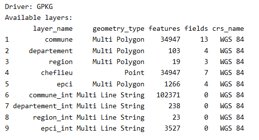{fig-align="center"}

L'objet `dep` combine des polygones (le contour des départements, attribut `geom`) et des données dans un objet de type `data.frame` ou `tibble`.

------------------------------------------------------------------------

Ce `data.frame` se comporte comme n'importe quel autre (même utilisation des fonctions `str()`, `names()`, les fonctions de `{dplyr}`...).

```r
head(dep)
```

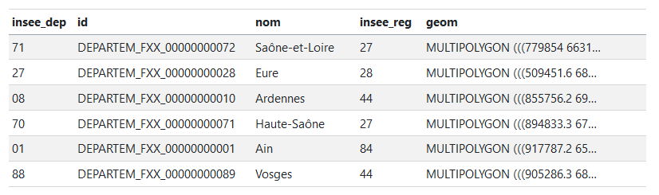{fig-align="center"}

`plot()` permet d'afficher le fond spatial pour toutes les variables dans la fenêtre graphique ([documentation](https://r-spatial.github.io/sf/reference/plot.html)).

```r
plot(dep)
```

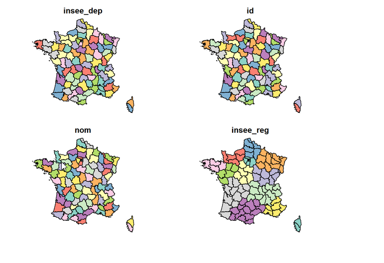{fig-align="center"}

------------------------------------------------------------------------

### Jointure avec le RA 2020

```r
exp_dep <- read_rds("~/CERISE/03-Espace-de-Diffusion/030_Structures_exploitations/3020_Recensements/RA_2020/01_BASES DIFFUSION RA2020/DEF_240112/RA2020_EXPLOITATIONS_240112.rds") |> 
  as_tibble(.name_repair = make_clean_names) |>
  filter(champ_geo == "1") |> 
  group_by(siege_dep) |> 
  summarise(n_exp = n(),
            n_exp_bio = sum(bio_fil, na.rm = TRUE)) |> 
  mutate(part_exp_bio = n_exp_bio / n_exp * 100)

head(exp_dep)

bio <- dep |> 
  left_join(exp_dep, by = c("insee_dep" = "siege_dep"))
```

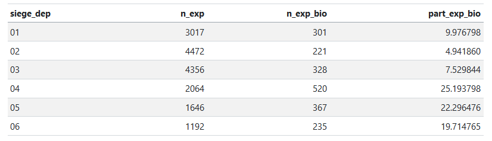{fig-align="center"}

------------------------------------------------------------------------

Affichage minimaliste par défaut avec fonction [`sf::plot()`](https://r-spatial.github.io/sf/reference/plot.html), e.g. `plot(bio |> select(geom, part_exp_bio))`.

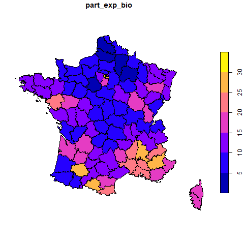{fig-align="center"}

## Carte choroplèthe avec `tm_polygons`

```r
tm_shape(bio) +
    tm_polygons("part_exp_bio")
```

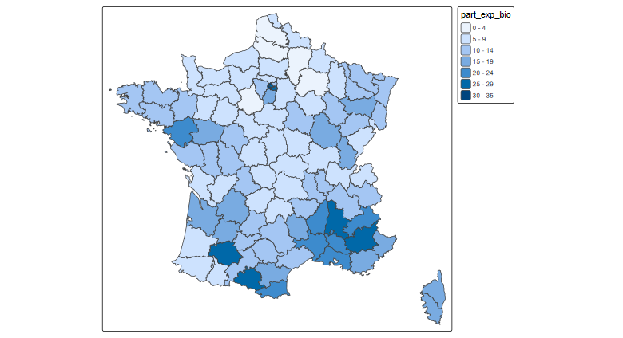

------------------------------------------------------------------------

## Carte interactive

```r
# "view" = interactif <https://r-tmap.github.io/tmap/reference/tmap_mode.html>
tmap_mode("view")
tm_shape(bio) +
    tm_polygons(
        "part_exp_bio",
        col = "grey60",
        fill.scale = tm_scale_intervals(
            style = "pretty", # default
            n = 5,
            values = "brewer.bu_gn",
            label.format = tm_label_format(
                text.separator = " - "
            )
        ),
        fill.legend = tm_legend(
            title = "part en %",
            lwd = 0.25, # lwd = line width
            reverse = TRUE,
        )
    )
```


---

Carte _interactive_ avec symbologie sur mesure.

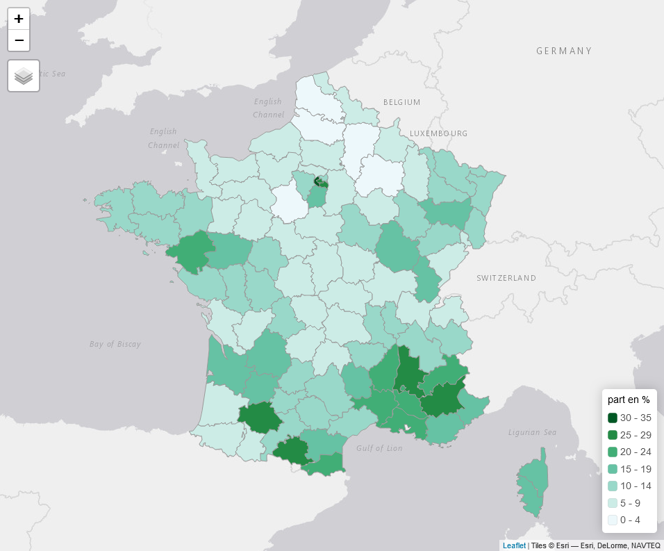{fig-align="center"}

## Carte à symboles proportionnels

```r
# "plot" = statique <https://r-tmap.github.io/tmap/reference/tmap_mode.html>
tmap_mode("plot")

tm_shape(bio) +
    tm_borders(col = "grey30", lwd = 0.25) +
    tm_symbols(
        size = "n_exp",
        size.scale = tm_scale(values.scale = 1.5),
        fill = "darkolivegreen4",
        size.legend = tm_legend(
            title = "Nombre d'exploitations en AB",
            orientation = "landscape",
            position = tm_pos_in()
        )
    )
```

---

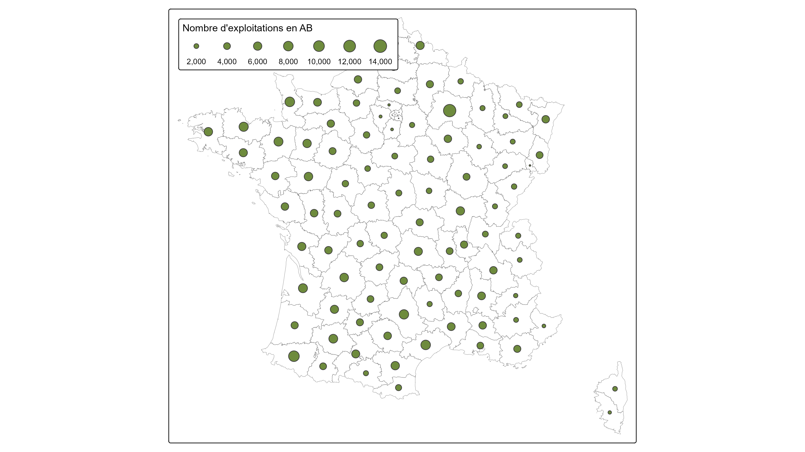{fig-align="center"}

## Carte choroplèthe + symboles proportionnels

```r
tm_shape(bio) +
    tm_polygons(
        "part_exp_bio",
        col = "grey60",
        fill.scale = tm_scale_intervals(
            values = "brewer.bu_gn",
        ),
        fill.legend = tm_legend(
            title = "Part d'exploitations en AB (en %)",
            reverse = TRUE,
        )
    ) +
    tm_symbols(
        size = "n_exp",
        size.scale = tm_scale(values.scale = 1.5),
        fill = "darkolivegreen4",
        size.legend = tm_legend(
            title = "Nombre d'exploitations en AB",
            reverse = TRUE,
        )
    )
```

---

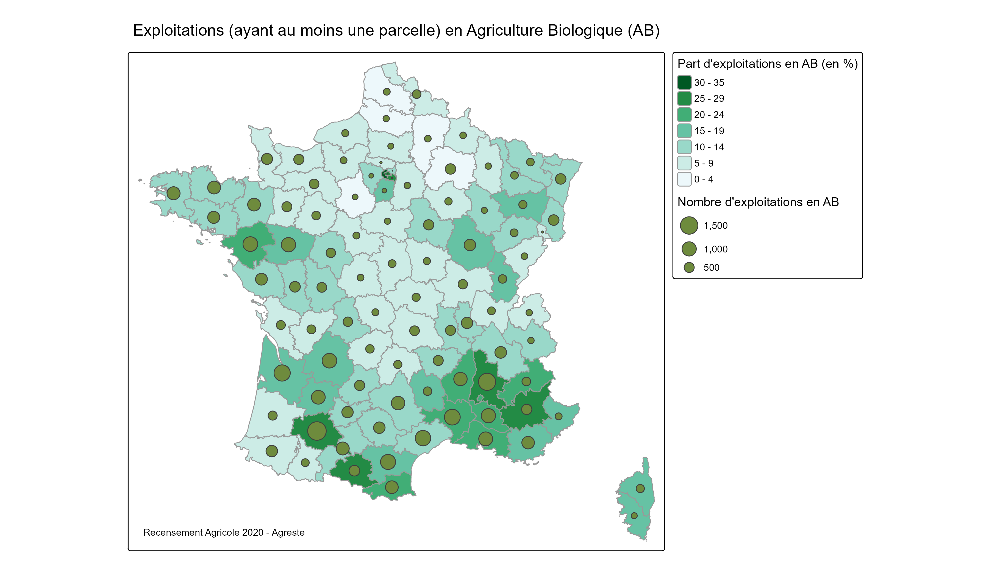{fig-align="center"}

## Variante

Une alternative consiste à faire varier la taille + la couleur du cercle : les couleurs des classes de la variable représentée en aplats sont placées dans les ronds proportionnels.

```r
tm_shape(bio) +
    tm_borders(col = "grey30", lwd = 0.25) +
    tm_symbols(
        fill = "part_exp_bio",
        fill.scale = tm_scale(
            values = "brewer.bu_gn"
        ),
        fill.legend = tm_legend(
            title = "Part d'exploitations en AB (en %)",
            reverse = TRUE,
            position = tm_pos_in("left", "bottom"),
        ),
        size = "n_exp",
        size.scale = tm_scale(
            values.scale = 1.5
        ),
        size.legend = tm_legend(
            title = "Nombre d'exploitations en AB",
            position = tm_pos_in("left", "bottom"),
            frame = FALSE,
            bg.alpha = 0.0
        ),
    )
```

---

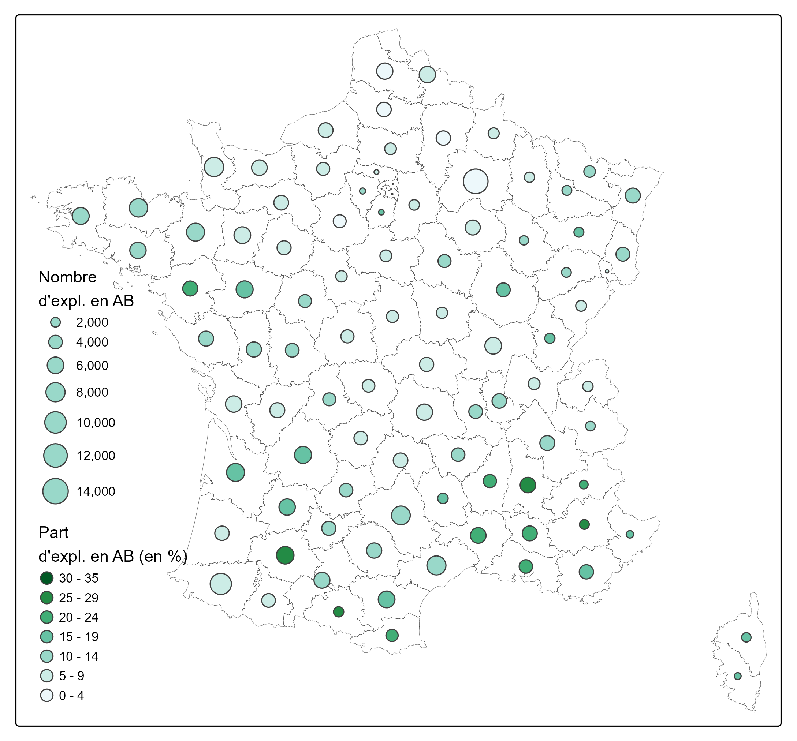{fig-align="center"}

---

```r
tmap_mode("view")
```

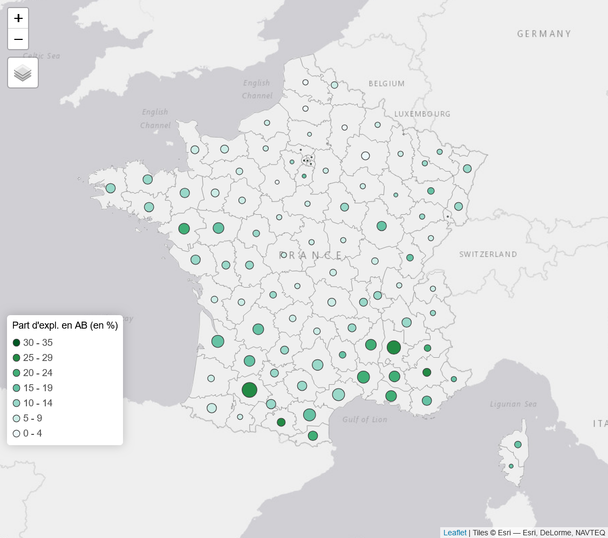{fig-align="center"} 


## Couleurs et palettes

Les couleurs sont à préciser dans l'argument `values` de la fonction `tm_scale()` des arguments `.scale` comme `fill.scale`.

- Le site <https://r-charts.com/colors/> présente les couleurs de base en R.
- Le package [`{cols4all}`](https://cols4all.github.io/cols4all-R/) (par l'auteur de `{tmap}`) propose une fonction `cols4all::c4a_gui()` qui permet de visualiser des palettes de couleurs, en simulant les déficiences visuelles.

---

```r
pal_vir <- c4a("viridis", n = 5)
colorspace::specplot(pal_vir)
```

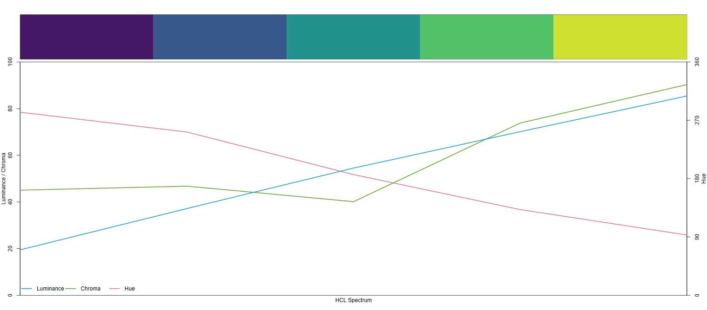{fig-align="center"}

------------------------------------------------------------------------

```r
pal_div <- c4a("brewer.prgn", n = 7)
colorspace::specplot(pal_div)
```

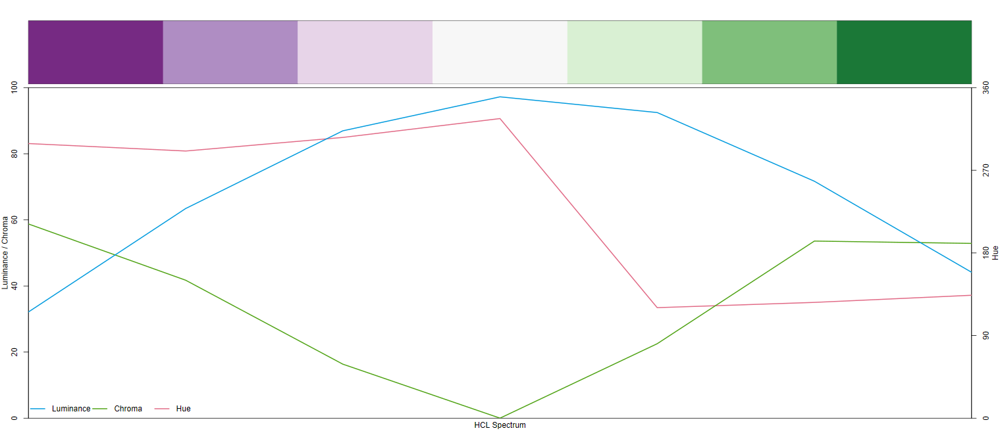{fig-align="center"}

------------------------------------------------------------------------

```r
c4a_types()
```

```raw
  type                          description
1  cat                          categorical
2  seq                           sequential
3  div                            diverging
4  cyc                               cyclic
5 bivs  bivariate (sequential x sequential)
6 bivc bivariate (sequential x categorical)
7 bivd   bivariate (sequential x diverging)
8 bivg bivariate (sequential x desaturated)
```

---

```r
c4a_overview()
```

```raw
       series                                         description cat seq div cyc bivs bivc bivd bivg
1     bivario            Palettes from the Python library bivario   0   0   0   0   25    0    0    0
2      brewer                                ColorBrewer palettes   8  18   9   0    2    2    1    0
3       carto                          Palettes designed by CARTO   6  21   7   0    0    0    0    0
4    cols4all                  cols4all palettes (in development)  14   0   2   0    2    0    2    5
5         gmt                 Palettes from General Mapping Tools   0  19   4   0    0    0    0    0
6         hcl  Palettes from the Hue Chroma Luminance color space   9  23  11   6    0    0    0    0
7      kovesi                   Palettes designed by Peter Kovesi   0  28  14   8    0    0    0    0
8  matplotlib         Palettes from the Python library matplotlib   0  51  12   3    0    0    0    0
9         met Palettes inspired by The Metropolitan Museum of Art  33   8  14   0    0    1    0    0
10      meteo           Palettes by Oliver Fuhrer from MeteoSwiss   2  14   7   0    0    0    0    0
11       misc                              Miscellaneous palettes   5   0   0   0    0    3    0    0
12      ocean          Colormaps for Oceanography by Thyng et al.   0  15   3   0    0    0    0    0
13      parks                 Palettes inspired by National Parks  22   5   3   0    0    0    0    0
14       poly               Qualitative palettes with many colors   9   0   0   0    0    0    0    0
15    powerbi                    Palettes from Microsoft Power BI  19   1   4   0    0    0    0    0
16      scico             Scientific colour maps by Fabio Crameri  21  21  10   5    0    2    0    1
17    seaborn            Palettes from the Python library Seaborn   6   4   2   0    0    0    0    0
18    stevens                Bivariate palettes by Joshua Stevens   0   5   0   0    5    0    0    0
19    tableau                        Palettes designed by Tableau  29  23  28   0    0    3    0    0
20        tol                       Palettes designed by Paul Tol   8   8   4   0    0    0    0    0
21        wes                   Palettes from Wes Anderson movies  23   0   1   0    0    0    0    0
```

------------------------------------------------------------------------

```r
c4a_scores(series = "brewer", type = "div") |> as_tibble()
```

```raw
# A tibble: 9 x 37
  name   series fullname type      n min_dist nameability min_step max_step inter_wing_dist tri_ineq  Cmax     H    HL    HR  Lmid Hwidth HwidthL HwidthR Lrange Crange fairness CRmin
  <chr>  <chr>  <chr>    <chr> <dbl>    <dbl>       <dbl>    <dbl>    <dbl>           <dbl>    <dbl> <dbl> <dbl> <dbl> <dbl> <dbl>  <dbl>   <dbl>   <dbl>  <dbl>  <dbl>    <dbl> <dbl>
1 br_bg  brewer brewer.~ div       9       NA          NA     3.23       NA            7.52    -0.82    72   110    54   180    97    145      33       6     58     72       64  1.06 
2 pi_yg  brewer brewer.~ div       9       NA          NA     3.84       NA           13.6      2.91    97    44   336   112    97    151      16      16     53     97       23  1.07 
3 prgn   brewer brewer.~ div       9       NA          NA     8.25       NA           12.9      6.33    62   360   300   127    97    187      14      15     65     62       78  1.13 
4 pu_or  brewer brewer.~ div       9       NA          NA     7.21       NA           15.5      5.27    98   340    44   270    97    158      29      19     70     98       22  1.09 
5 rd_bu  brewer brewer.~ div       9       NA          NA     7.22       NA           12.1      5.32   111   313    26   238    97    177      32      27     59    111       10  1    
6 rd_gy  brewer brewer.~ div       9       NA          NA     6.5        NA            6.34    -2.35   111    26    26   180   100     32      32       0     67    111       10  1.01 
7 rd_yl~ brewer brewer.~ div       9       NA          NA     7.56       NA           22.1      3.21   132   360    40   230    99    237      55      41     51    120        6  1.03 
8 rd_yl~ brewer brewer.~ div       9       NA          NA     6          NA            0.52    -7.69   132    75    40   118    99    125      56      40     51     87       38  1.03 
9 spect~ brewer brewer.~ div       9       NA          NA     3.84       NA            0.53    -6.25   115   360    38   167    99    233      61     147     49     72       64  1.1  
# i 14 more variables: CRwt <dbl>, CRbk <dbl>, Blues <dbl>, cbfriendly <dbl>, chroma <chr>, Hspread <dbl>, fair <chr>, hues <chr>, HwidthLR <dbl>, equiluminance <lgl>,
#   contrastWT <lgl>, contrastBK <lgl>, float <lgl>, nameable <lgl>
```

# Discrétisation des données en classes

## Construction automatique des classes

L'argument `style` de la fonction `tm_scale_intervals()` utilisée dans les arguments `.scale` des objets cartographiques créés avec `tm_polygons()` permet de définir **la méthode (automatique) de création des classes**, l'argument `n` reçoit _le nombre de classes à construire_.

Les arguments passés à [`classInt::classIntervals()`](https://r-spatial.github.io/classInt/reference/classIntervals.html) qui fait le calcul.

---

Les méthodes disponibles sont `"cat"`, `"fixed"`, `"sd"`, `"equal"`, `"pretty"`, `"quantile"`, `"kmeans"`, `"hclust"`, `"bclust"`, `"fisher"`, `"jenks"`, `"dpih"`, `"headtails"` et `"log10_pretty"`.
Les principales sont :

- `"sd"` : classes construites à partir de la moyenne et dont les amplitudes valent un écart-type (_standard deviation_),
- `"equal"` : classes d'amplitudes égales,
- `"quantile"` : classes de même effectif,
- `"fisher"` ou `"jenks"` : classes construites avec une méthode qui _minimise les variances intra-classes_ et _maximise les variances inter-classes_,
- `"headtails"` : classes pour les distributions avec de nombreuses valeurs hautes,
- ...

Voir fichier [12_demo_classes.R](R/12_demo_classes.R) pour la génération des illustrations après.
**Toutes ne sont pas adaptées au cas**.

---

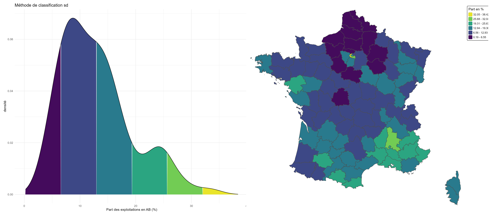{fig-align="center"}

---

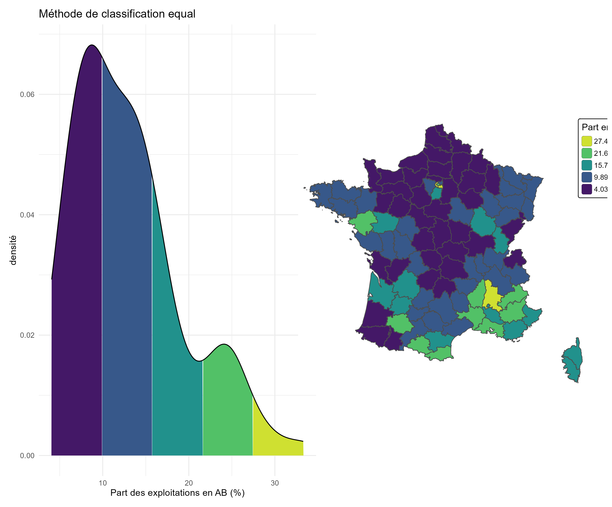{fig-align="center"}

---

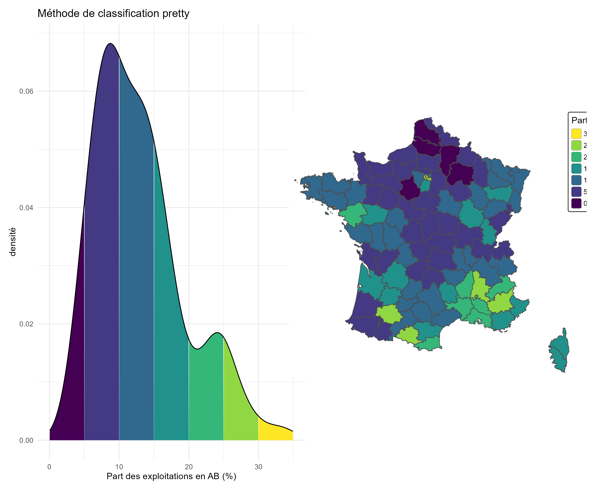{fig-align="center"}

---

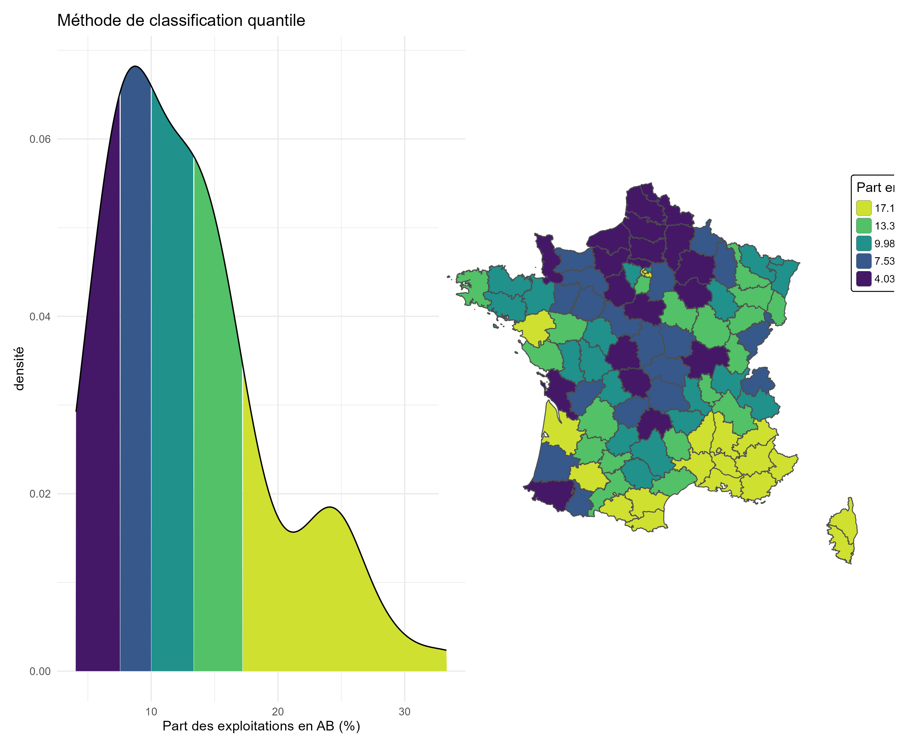{fig-align="center"}

---

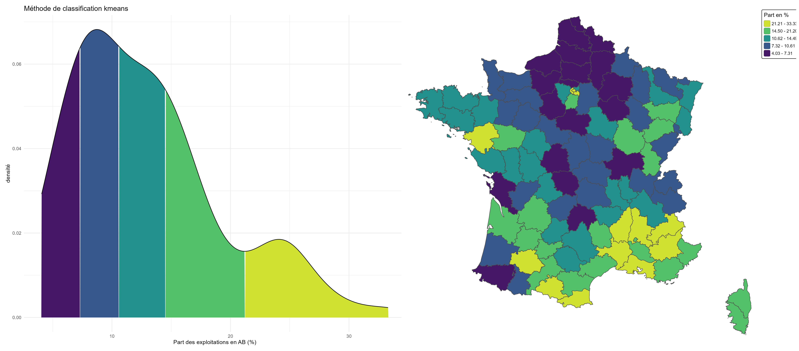{fig-align="center"}

---

{fig-align="center"}

---

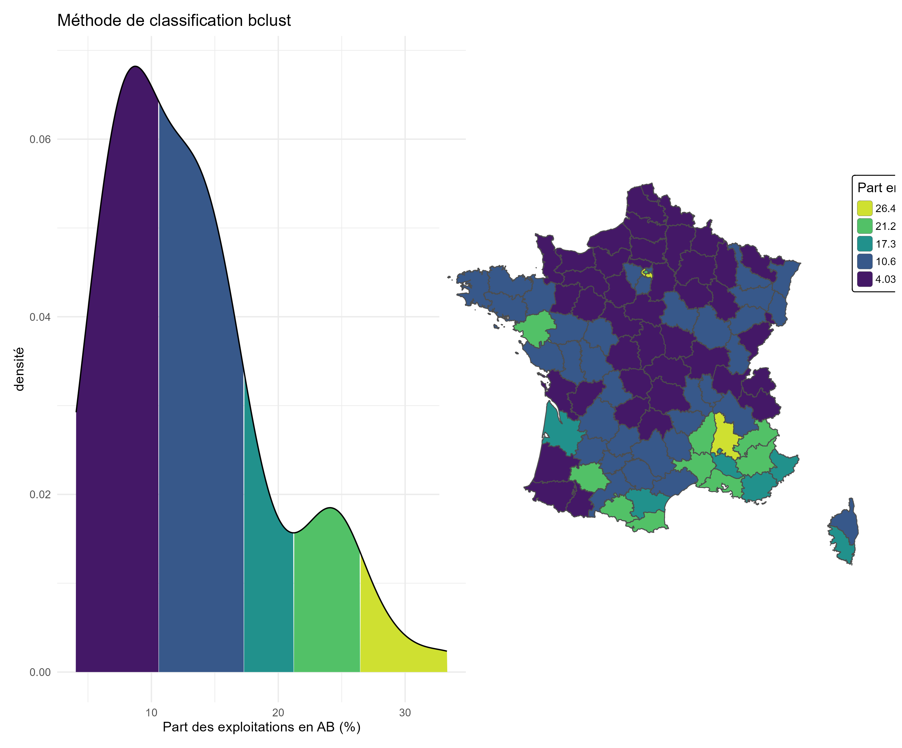{fig-align="center"}

---

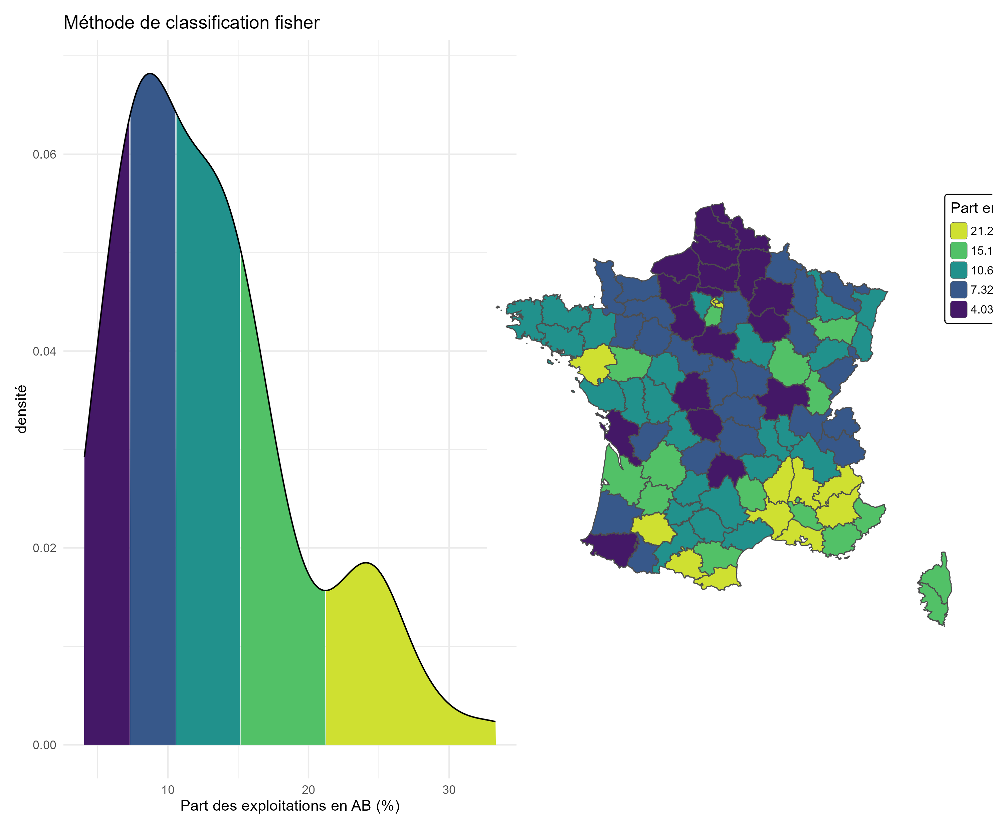{fig-align="center"}


---

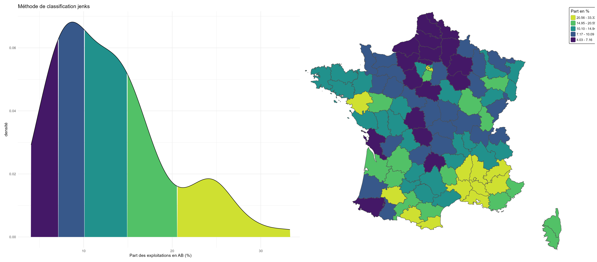{fig-align="center"}

---

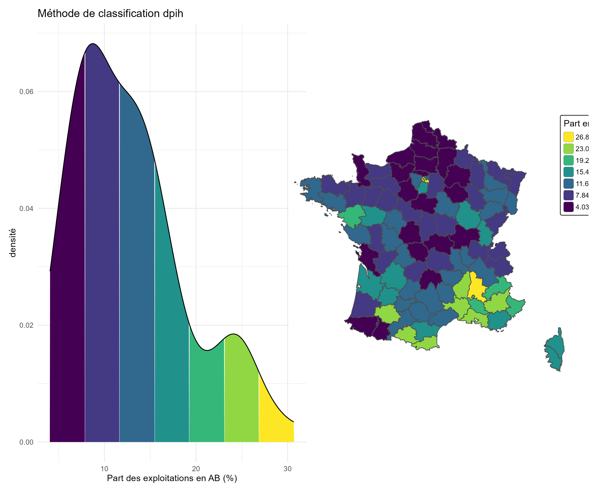{fig-align="center"}

---

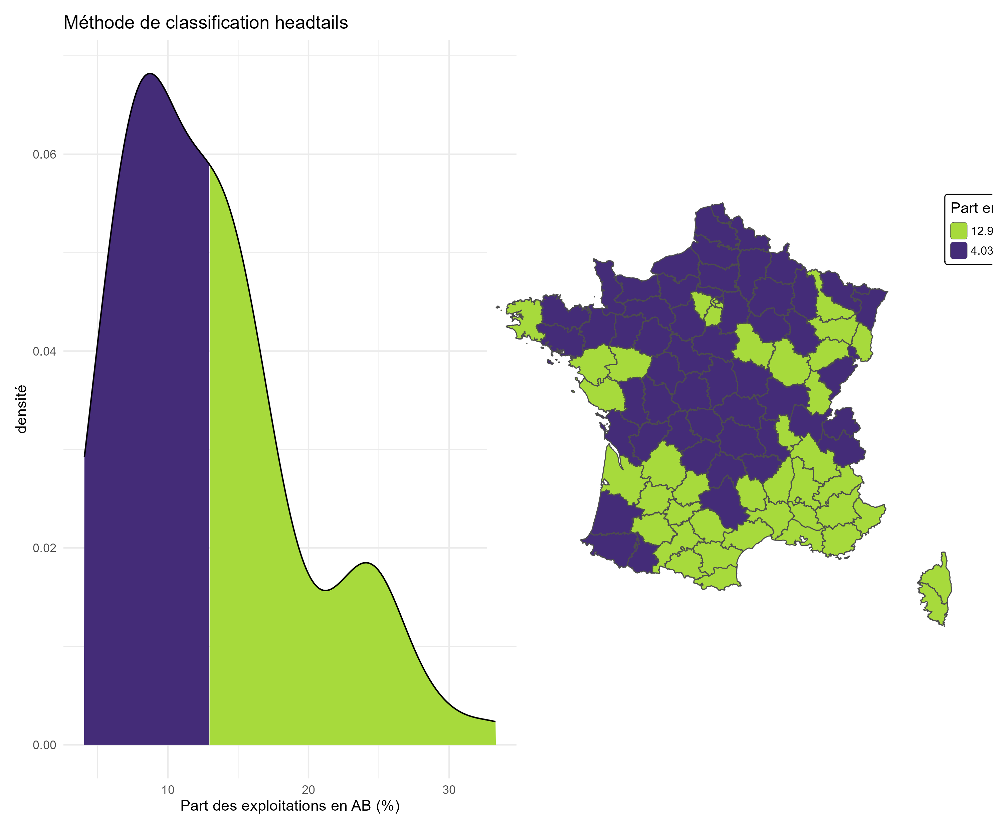{fig-align="center"}

---

## Construction manuelle des classes

Il est possible de renseigner _manuellement_ ses propres classes dans l'argument `breaks` de la fonction `tm_scale_intervals(style = "fixed")`.
Pour renseigner un découpage en *n* classes, l'argument `breaks` doit contenir **un vecteur de taille n+1** : `c(min, borne₁, borne₂, … , borneₙ₋₁, max)`.

Exemple sur _le % d'exploitation en AB_ : la méthode `"quantile"` à 5 classes donne les ruptures comme suit, qu'on peut  arrondir et passer à `breaks`.

---

```r
cesures <- classIntervals(bio$part_exp_bio, style = "quantile", n = 5)
cesures
# style: quantile
#   one of 3,183,545 possible partitions of this variable into 5 classes
# [4.02,7.52) [7.52,9.97) [9.97,13.38)  [13.38,17.18)  [17.18,33.33]
#         19          19           19             19             20 

tm_shape(bio) +
    tm_polygons(
        ...
        fill.scale = tm_scale_intervals(
            style = "fixed",
            breaks = round(cesures$brks, 1),
            values = c4a("viridis", n = 5),
        ),
        ...
    )

classIntervals(bio$part_exp_bio, style = "jenks", n = 5)
# style: jenks
#   one of 3,183,545 possible partitions of this variable into 5 classes
# [4.02,7.17] (7.17,10.10] (10.10,14.94] (14.94,20.55] (20.55,33.33]
#         18            24           26            15            13 
```


# Autres fonctionnalités

## Habillage de la carte

```r
tmap_mode("plot")

m <- tm_shape(bio) +
  tm_polygons("part_exp_bio", 
              style = "pretty",
              n = 5,
              title = "part en %", 
              palette = "BuGn",
              border.col = "grey30",
              lwd = 0.25,
              legend.reverse = TRUE, 
              legend.format = list(text.separator = " - ")) + 
  tm_text("insee_dep",
          size = 0.5,
          remove.overlap = TRUE) +
  tm_layout("Exploitations\nen conduite bio", 
            scale = .8,
            legend.position = c("left", "center"),
            fontfamily = "Marianne") +
  tm_credits(paste0("données Agreste RA 2020\nfond carto. d'après IGN AdminExpress 2023\n", 
                    Sys.Date()),
             size = 0.5,
             position = c(0.2, 0.01)) +
  tm_scale_bar(color.dark = "grey40",
               width = 0.2,
               position = c(0.45, 0.01)) +
  tm_compass(type = "rose",
             position = c(0.7, 0.01),
             size = 1.5) +
  tm_logo("logo_masa.png", 
          position = c("left", "bottom"), 
          height = 3)

m

tmap_save(m, "pcent_bio_fr.png", 
          width = 20, units = "cm", asp = 1.618,
          dpi = 300,
          device = agg_png)


# ou pour une carte interactive :
# 
# tmap_mode("view")
# tmap_save(m, "pcent_bio_fr.html")
```

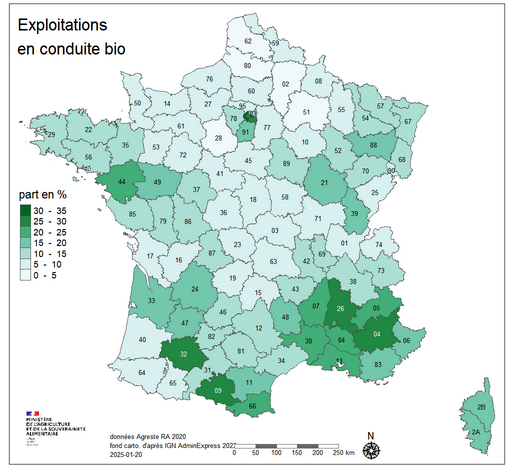{fig-align="center"}

## Facettes

::::: columns
::: {.column width="45%"}

```r
tmap_mode("plot")

tm_shape(bio) +
tm_polygons("part_exp_bio", 
            style = "pretty",
            n = 5,
            title = "part en %", 
            palette = "BuGn",
            border.col = "grey30",
            lwd = 0.25,
            legend.reverse = TRUE, 
            legend.format = list(text.separator = " - ")) +
tm_facets("insee_reg") +
tm_layout("Exploitations\nen conduite bio\npar région")
```

:::

::: {.column width="55%"}
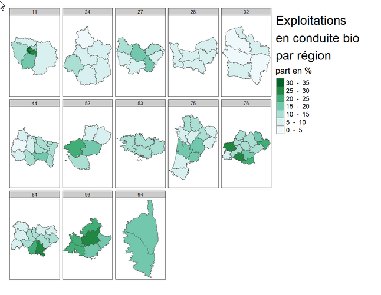{fig-align="center"}
:::
:::::

## Cartogramme

::::: columns
::: {.column width="45%"}

```r
library(cartogram)

bio |> 
  cartogram_dorling("n_exp") |> 
  tm_shape() + 
  tm_polygons("n_exp", 
              legend.reverse = TRUE, 
              style = "quantile",
              n = 5) +
  tm_text("insee_dep", size = 0.8) +
  tm_layout(legend.outside = TRUE)
```

:::

::: {.column width="55%"}
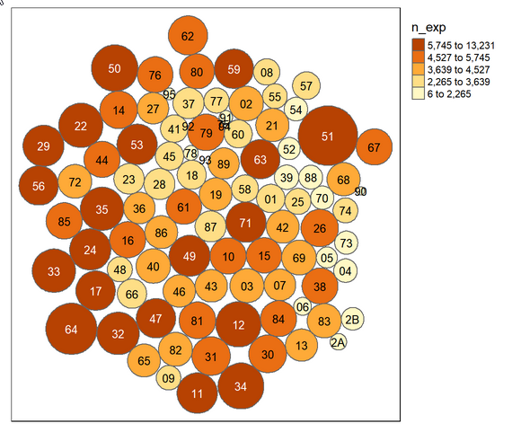{fig-align="center"}
:::
:::::


## Grilles

::::: columns
::: {.column width="45%"}

```r
library(geogrid)

bio |> 
  calculate_grid(grid_type = "hexagonal", seed = 3) |> 
  assign_polygons(bio, new_polygons = _) |>  
  tm_shape() + 
  tm_polygons("part_exp_bio",
              legend.reverse = TRUE) +
  tm_text("insee_dep", size = 0.8) +
  tm_layout(legend.outside = TRUE)
```

:::

::: {.column width="55%"}
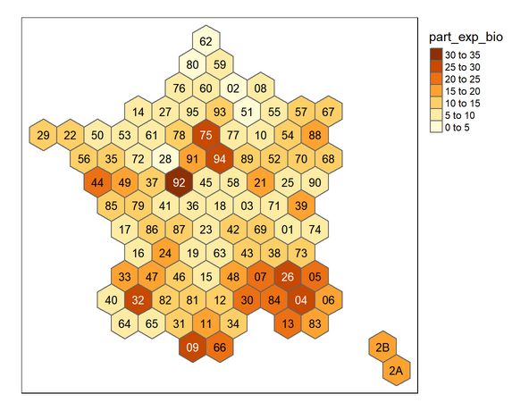{fig-align="center"}
:::
:::::

# Bibliographie

## Liens utiles

- La [vignette du package tmap](https://cran.r-project.org/web/packages/tmap/vignettes/tmap-getstarted.html)
- Le [livre](https://r-tmap.github.io/tmap-book/)
- Les [couleurs de R](https://r-charts.com/colors/)

## Aller plus loin

- GUR : [Cartographie avec R](https://ged.national.agri/gedsi/nxdoc/default/88702758-b87d-4eac-bc4d-218fcfdbf238/view_documents)
- La formation MTES [Analyses spatiales avec R](https://mtes-mct.github.io/parcours_r_module_analyse_spatiale/)

## Références

- Crameri, Fabio, Grace E. Shephard, et Philip J. Heron. 2020. « The Misuse of Colour in Science Communication ». *Nature Communications 11* (1): 5444. <https://doi.org/10.1038/s41467-020-19160-7>.
- Engelaere-Lefebvre, Juliette, Maël Theulière, et Jean-Daniel Lomenède. 2023. « Analyses spatiales avec R ». *Formations R aux MTES & MCTRCT*. [https://mtes-mct.github.io/parcours_r_module_analyse_spatiale/](https://mtes-mct.github.io/parcours_r_module_analyse_spatiale/.)
- Harrower, Mark, et Cynthia A. Brewer. 2003. « ColorBrewer. Org: An Online Tool for Selecting Colour Schemes for Maps ». *The Cartographic Journal 40* (1): 27‑37. <https://doi.org/10.1179/000870403235002042>.
- Loonis, Vincent, et Marie-Pierre de Bellefon. 2018. Manuel d’analyse spatiale. Théorie et mise en œuvre pratique avec R. Insee Méthodes 131. Montrouge: INSEE - Eurostat. <https://www.insee.fr/fr/information/3635442>.
- Lovelace, Robin, Jakub Nowosad, et Jannes Muenchow. 2023. Geocomputation with R. <https://r.geocompx.org/>.
- Pebesma, Edzer, et Roger Bivand. 2023. Spatial Data Science: With Applications in R. New York: Chapman and Hall/CRC. <https://doi.org/10.1201/9780429459016>.
- Rowe, Francisco, et Dani Arribas-Bel. 2022. Spatial Modelling for Data Scientists. University of Liverpool. <https://gdsl-ul.github.io/san/>.

------------------------------------------------------------------------

- Theulière, Maël. 2019. « Les données spatiales avec R ». <https://maeltheuliere.github.io/rspatial/index.html>.
- Wimberly, Michael C. 2023. Geographic Data Science with R: Visualizing and Analyzing Environmental Change. <https://bookdown.org/mcwimberly/gdswr-book/>.
- Zeileis, Achim, Kurt Hornik, et Paul Murrell. 2009. « Escaping RGBland: Selecting Colors for Statistical Graphics ». Research {{Report Series}} 61. Vienna: Department of Statistics and Mathematics, WU Vienna University of Economics and Business. <http://www.sciencedirect.com/science/article/pii/S0167947308005549>.
- Zeileis, Achim, et Paul Murrell. 2023. « Coloring in R’s Blind Spot ». The R Journal 15 (3): 240‑56. <https://doi.org/10.32614/RJ-2023-071>.

# Exercices

## Données

Réaliser la carte de densité de population communale du département de l'Aisne.

Le fichier de données est le fichier *popD02_2013.rds*.
Le fond de carte est le fichier *ComD02.TAB*.

```r
#| code-fold: true

com <- read_sf("donnees_exercices/ComD02.TAB") |> 
  clean_names()

pop <- read_rds("donnees_exercices/popD02_2013.rds") |> 
  as_tibble(.name_repair = make_clean_names)

com_pop <- com |> 
  select(-libgeo, -surf) |> 
  left_join(pop, join_by(codgeo)) |> 
  mutate(dpop_habkm2 = pop13 / surf,
         evol_pop_pcent = (pop13 - pop08) / pop08 * 100)
```

## Densité de pop

```r
#| code-fold: true

com_pop |> 
  tm_shape() +
  tm_polygons("dpop_habkm2",
              style = "kmeans",
              legend.reverse = TRUE, 
              palette = "viridis")
```

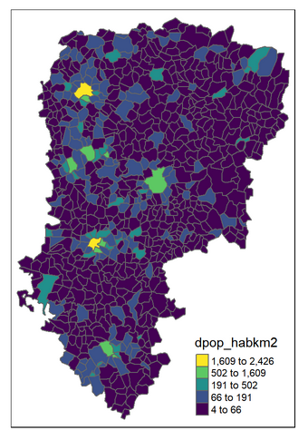{fig-align="center"}

## Évolution pop

Réaliser la carte d'évolution de la population communale du département de l'Aisne. On différenciera les évolutions positives et les évolutions négatives.

Le fichier de données et le fond de carte sont les mêmes que pour l'exercice précédent.

```r
#| code-fold: true

com_pop |> 
  tm_shape() +
  tm_polygons("evol_pop_pcent")
```

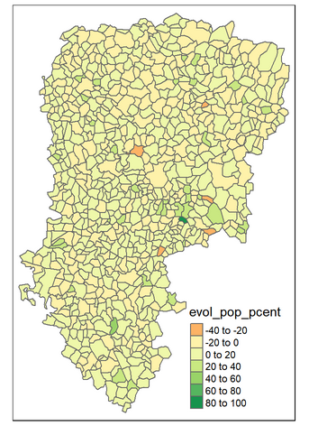{fig-align="center"}

## Classes

Reprendre la carte précédente en construisant des classes manuelles.

```r
#| code-fold: true

com_pop |> 
  tm_shape() +
  tm_polygons("evol_pop_pcent",
              breaks = c(-20, -10, -5, 5, 10, 20),
              midpoint = 0,
              legend.reverse = TRUE)
```

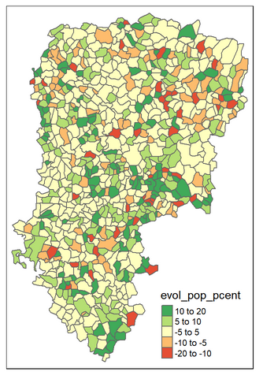{fig-align="center"}

## Couleurs

Reprendre la carte précédente en personnalisant les couleurs.

```r
#| code-fold: true

com_pop |> 
  tm_shape() +
  tm_polygons("evol_pop_pcent",
              style = "fixed",
              breaks = c(-20, -10, -5, 5, 10, 20),
              legend.reverse = TRUE, 
              midpoint = 0,
              palette = "PRGn")
```

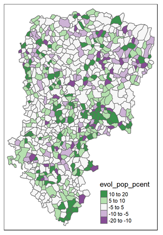{fig-align="center"}

pour inverser la palette : `"-PRGn"`

## Finalisation

Habiller la carte construite au fil des exercices précédents.

```r
#| code-fold: true

villes <- com_pop |> 
  filter(pop13 > 10000)

m <- com_pop |> 
  tm_shape() +
  tm_polygons("evol_pop_pcent",
              title = "variation\nhabitants (%)",
              style = "fixed",
              breaks = c(-Inf, -20, -10, -5, 5, 10, 20, Inf),
              legend.reverse = TRUE, 
              midpoint = 0,
              legend.format = list(text.separator = "à",
                                   text.less.than = "moins de",
                                   text.or.more = "ou plus"),
              palette = "PRGn") +
  tm_shape(villes) +
  tm_symbols(size = 0.1, 
             col = "black") +
  tm_text("libgeo", 
          size = 0.5,
          just = -0.1, 
          shadow = TRUE, ) +
  tm_layout(main.title = "Évolution de la population - Aisne 2008-2013",
            main.title.size = 0.9,
            scale = .8,
            legend.position = c(0.7, 0.15),
            fontfamily = "Marianne") +
  tm_credits(paste0("données INSEE RP 2020\nfond carto. d'après IGN\n", 
                    Sys.Date()),
             size = 0.5,
             position = c(0.6, 0.05)) +
  tm_scale_bar(color.dark = "grey40",
               width = 0.2,
               position = c(0.6, 0.01)) +
  tm_compass(type = "rose",
             position = c(0.9, 0.01),
             size = 1.5) +
  tm_logo("logo_masa.png", margin = 0,
          position = c("left", "bottom"), 
          height = 3)
m
```

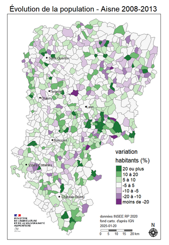{fig-align="center"}

## Exporter en PDF

Exporter la carte au format PDF.

```r
#| code-fold: true

tmap_save(m, "population_002_2008-2013.pdf", 
          width = 20, height = 28.7, units = "cm",
          dpi = 300,
          device = cairo_pdf)
```
